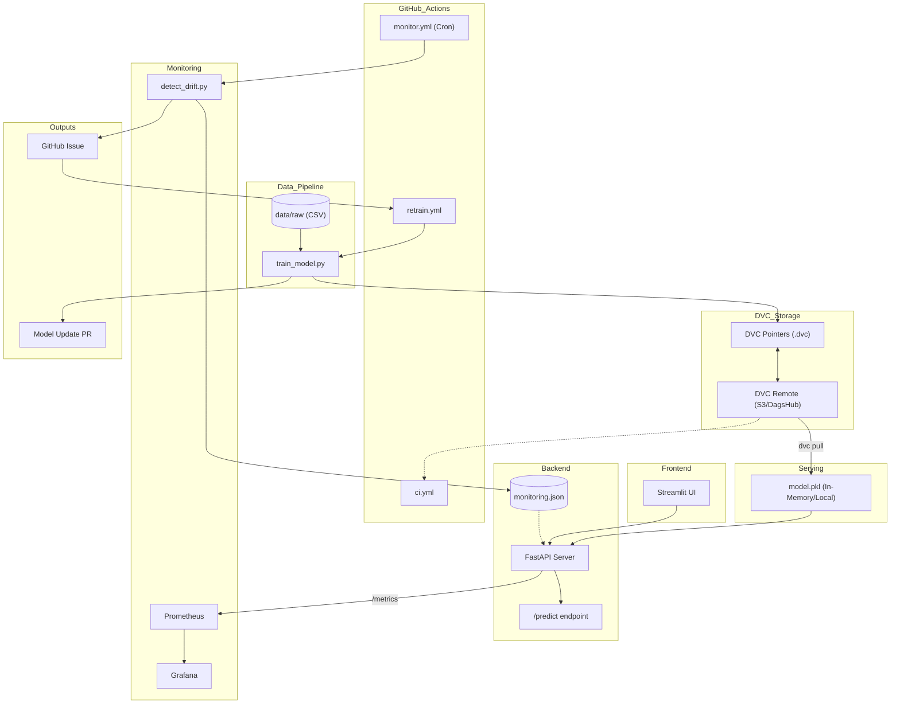
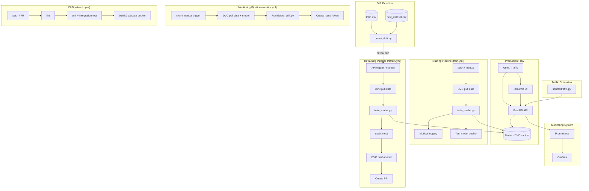

# Customer Churn Predictor

## 1. Project Overview

### 📌 Problem Description
This project focuses on predicting **customer churn**, a critical problem in subscription-based businesses. Churn prediction helps companies identify customers who are likely to leave, enabling proactive retention strategies.

### 🎯 Goal
* Build an end-to-end Machine Learning pipeline for churn prediction.
* Deploy the model as a scalable API service.
* Monitor model performance and enable retraining workflows.

### 📊 Evaluation Metrics
Given the **class imbalance nature** of churn datasets, the project focuses on:
* **F1-score** (primary metric)
* **Recall** (to minimize false negatives — missing churners)
* **Accuracy** (for general reference)

### 📂 Data
- Source: https://www.kaggle.com/datasets/muhammadshahidazeem/customer-churn-dataset/data
- Total number of observations (rows): 440,831
- Total number of attributes (columns): 11
- Target Variables: `Churn` (Binary class)
- Numerical Features: `Age`, `Tenure`, `Usage Frequency`, `Support Calls`, `Payment Delay`, `Total Spend`, `Last Interaction`
- Category Features: `Gender`, `Subscription Type`, `Contract Length`


| Variable Name | Description | Feature Taxonomy | Example (Value & Unit) |
| :--- | :--- | :--- | :--- |
| **Age** | The age of the customer. | Demographics | `28` (Years) |
| **Gender** | The biological sex of the customer. | Demographics | `Male` / `Female` |
| **Tenure** | Duration of the customer's relationship with the company. | Usage Behavior | `12` (Months) |
| **Usage Frequency** | How often the customer uses the service per month. | Usage Behavior | `15` (Times/Month) |
| **Support Calls** | The number of times the customer contacted customer support center. | Usage Behavior | `4` (Calls) |
| **Payment Delay** | Number of days the customer is late on their billing. | Usage Behavior | `7` (Days) |
| **Last Interaction** | Days elapsed since the last customer engagement. | Usage Behavior | `3` (Days ago) |
| **Subscription Type** | The specific service tier chosen by the customer. | Contractual Info | `Basic`, `Standard`, `Premium` |
| **Contract Length** | The commitment period of the service agreement. | Contractual Info | `Monthly`, `Quarterly`, `Annual` |
| **Total Spend** | Total revenue generated from the customer to date. | Contractual Info | `1250.50` (Currency Units) |
| **Churn** | Target variable indicating if the customer has left. | Contractual Info | `1` (Yes) or `0` (No) |

*Note: The dataset used in this project is a **synthetic/generated dataset** from Kaggle. While it lacks some real-world noise, its large scale (440k+ records) allows for a robust demonstration of MLOps pipeline automation and model scalability.*

## 3. Project Structure

```bash
.
├── .github/                  # CI/CD pipelines (train, retrain, monitoring)
│   └── workflows/
│       ├── ci.yml
│       ├── train.yml
│       ├── retrain.yml
│       └── monitor.yml
│
├── config/                  # model & drift detection config
│   ├── model_config.yaml
│   └── drift_config.yaml
│
├── data/                    # Data (managed DVC)
│   ├── raw/                 
│   └── preprocessed/       
│
├── models/                  # Model artifacts & versioning (e.g. model.pkl.dvc)
│
├── src/                     # ML pipeline
│   ├── api/                 # FastAPI (inference service)
│   ├── preprocess/          # Data preprocessing
│   ├── features/            # Feature engineering
│   └── models/              # Training logic
│
├── streamlit_app/           # UI dashboard (Streamlit)
│   ├── app.py
│   └── Dockerfile
│
├── monitoring/              # Monitoring & drift detection
│   ├── Grafana
│   ├── detect_drift.py
│   └── prometheus.yml
│
├── k8s/                     # Kubernetes manifests
│   ├── monitoring   
│   ├── namespace.yaml
│   ├── kustomization.yaml
│   ├── fastapi-*.yaml       # API deployment + service + HPA
│   ├── streamlit-*.yaml     # UI deployment + service
│   ├── prometheus-*.yaml    # Monitoring (Prometheus)
│   ├── grafana-*.yaml       # Dashboard (Grafana)
│   └── ingress.yaml         # Ingress routing
│
├── scripts/                 # New data generate & traffic simulation)
│   ├── merge_data.py
│   ├── simulate_labels.py
│   └── traffic.py
│
├── notebooks/               # EDA & experimentation
│   ├── 01_EDA.ipynb
│   ├── 02_Preprocessing_FeaturEngineer.ipynb
│   └── 03_Training.ipynb
│
├── tests/                   # Unit tests
│   ├── test_api.py
│   ├── test_data_pipeline.py
│   ├── test_drift_logic.py
│   └── test_model_quality.py
│
├── docker-compose.yml       # Local development setup
├── Dockerfile               # Container for API service
├── Makefile                 # Automation commands
├── pyproject.toml           # Dependency & project config
├── README.md
└── uv.lock
```

## 4. System Architecture

Upcoming ...




## 5. Enviroment Setup
### 5.1. Requirements
- Windows PowerShell (commands below assume PowerShell)
- Python **3.11+**
- Recommended: **uv** (this repo includes `pyproject.toml` + `uv.lock`)

### 5.2. Setup virtual environment

Firstly, you Install uv (if not already installed):

```powershell
pip install uv
```

Then you sync dependencies and activate environment:

```powershell
# Sync dependencies:
uv sync

# Activate environment
.\.venv\Scripts\Activate
```

## 6. Running Project Guidelines

### **Step 1: Clone repository**

```powershell
git clone https://github.com/chanhbui297/DSEB65A-Group04-customer-churn-predictor.git

cd DSEB65A-Group04-customer-churn-predictor
```
---
### **Step 2: Pull data using DVC**

To access the dataset, you need to configure the DVC remote with your credentials. Execute each command below, replacing **<Your_key>** with your actual **DagsHub Access Token**:

```powershell
# 1. Set the remote S3 URL
dvc remote modify origin url s3://DSEB65A-Group04-customer-churn-predictor

# 2. Set the DagsHub endpoint URL (Local config only)
dvc remote modify origin endpointurl https://dagshub.com/DSEB65A-Group04/customer-churn-predictor.s3 --local

# 3. Configure your Access Key (Local config only)
dvc remote modify origin access_key_id <Your_key> --local

# 4. Configure your Secret Key (Local config only)
dvc remote modify origin secret_access_key <Your_key> --local
```

**Verification**: Ensure `.dvc/config.local` exists and contains all 4 parameters. Once verified, download the data:

```powershell
dvc pull --force
```
**Expected Output (For first time pull)**
```shell
Collecting                                           |4.00 [00:00,  177entry/s]
Fetching
Building workspace index                             |4.00 [00:00, 92.9entry/s]
Comparing indexes                                    |9.00 [00:00, 5.32kentry/s]
Applying changes                                     |4.00 [00:00, 21.1file/s]
A       data\preprocessed\train.parquet
A       data\raw\new_dataset.csv
A       data\raw\train.csv
A       models\model.pkl
4 files fetched and 4 files added
```
--- 
###  **Step 3: Model Training**

### Option 1 — Train Model from Scratch

Training statistics are automatically saved in `models/run_xxx`. If you want to track the training process and metrics in your browser via MLflow, follow these steps:

```powershell
# Start the MLflow UI
mlflow ui
```
Access the dashboard at: http://localhost:5000 (*The dashboard will remain empty or outdated until the training process completes.*)

Open a new terminal (ensure the virtual environment is activated and you are in the project root) and run:

```powershell
python src/models/train_model.py `
  --data data/raw/train.csv `
  --model_dir models `
  --config config/drift_config.yaml `
  --n_iter 1
```
**Expected Output**
- Cleaned Data: `data/preprocessed/train.parquet`
- Training Run Folder: `models/run_<timestamp>/`
- Other output in `models/`

### Option 2 — Use Pre-trained Model (via DVC)

This option skips the training process and downloads the latest verified model artifacts directly from the remote storage.

*Note: Skip this if you already successfully executed dvc pull in Step 2.*

```powershell
dvc pull
```
---

### **Step 4: Run API Locally**

### 4.1. Start FastAPI Server
Choose the command based on your setup:

Using `uv`:
```powershell
uv run uvicorn src.api.main:app --reload
```
Or Using standard Python:
```powershell
python -m uvicorn src.api.main:app --reload
```
### 4.2. Verify API Status

Once the server starts, visit the interactive documentation at: http://127.0.0.1:8000/docs

**Available Endpoints:**

- GET / — Service welcome message.

- GET /health — Simple health check.

- POST /predict — Main churn probability prediction.

**Quick Health Check:** http://127.0.0.1:8000/health. 

You should see:
```JSON
{ "status": "ok" }
```

### 4.3. Test Prediction (Sample Request)

Run this PowerShell script to send a mock customer profile to the API:
```powershell
$body = @{
  age = 35
  gender = "Male"
  tenure = 12
  usage_frequency = 5
  support_calls = 1
  payment_delay = 0
  subscription_type = "Basic"
  contract_length = "Monthly"
  total_spend = 1200
  last_interaction = 3
} | ConvertTo-Json

Invoke-RestMethod `
  -Method Post `
  -Uri "[http://127.0.0.1:8000/predict](http://127.0.0.1:8000/predict)" `
  -ContentType "application/json" `
  -Body $body
```
**Expected Output**
```powershell
churn label      churn_probability
----- -----      -----------------
xxx              xxx
```

---
### **Step 5: Run Streamlit UI (Frontend)**

To interact with the model via a web interface, you need to start the Streamlit application.

**Keep the FastAPI server (Step 4) running**. Open a new Terminal window, activate the virtual environment, and run the following:

```powershell
# Run the Streamlit app
streamlit run streamlit_app/app.py
```
After running, you will be direct to link: http://localhost:8501

Try enter input, clink Run Prediction, and see the Results

---

### **Step 6: Monitoring and Data Drift Simulation Locally (Optional)**

This step allows you to simulate real-world traffic and test how the system detects Data Drift (changes in data distribution that can degrade model performance).

### 6.1. Prerequisites
The FastAPI server must be active. If it is not running from Step 4, start it now:

```powershell
# Terminal 1: Run API
uvicorn src.api.main:app --reload
```

**Check if FastAPI is running** 
- Swagger UI: http://127.0.0.1:8000/docs
- Health check: http://127.0.0.1:8000/health

### 6.2. Generate Traffic (User Simulation)

Open a new terminal to simulate continuous incoming requests from users:

```powershell
# Terminal 2: Simulate traffic (continuous)

$env:API_URL="http://127.0.0.1:8000/predict"
python scripts/traffic.py
```
**Expected output**
```powershell
Starting traffic simulation targeting: http://127.0.0.1:8000/predict
Success: Prediction received {'churn': xxx, 'label': xxx, 'churn_probability': xxx}
…
```

### 6.3. Simulate New Data 
Since Terminal 2 is occupied by the traffic loop, open Terminal 3 to simulate receiving new ground-truth labels and merging them into your training set:

```powershell
# Terminal 3: Run each code separately
python scripts/simulate_labels.py
python scripts/merge_data.py
```

**Expected Output:**

```powershell
Saved labeled data to data\raw\new_dataset_labeled.csv
INFO -  Merging on xxx common columns
WARNING - Removing xxx duplicate CustomerIDs from new data
INFO - Merged: xxx
INFO - Saved to data\raw\train.csv
INFO - New Churn rate: xxx
```

### 6.4. Run Drift Detection 

**Retraining Trigger:** In a local environment, the automated retraining trigger will only work if you provide a `TOKENFORMLOPS` environment variable. In the CI/CD pipeline, this is handled automatically via **GitHub Secrets**.

```powershell
# (If you have Github token) 
# $env:TOKENFORMLOPS=<your_github_token>
python monitoring/detect_drift.py `
  --ref data/raw/train.csv `
  --curr data/raw/new_dataset.csv `
  --model_dir models `
  --config config/drift_config.yaml
```

---
### **Step 7: Docker Deployment & Monitoring**

This step containerizes the entire MLOps stack, including the API, UI, and the monitoring infrastructure (Prometheus & Grafana).

### 7.1. Build and Pull Images

**Requirement**
- Docker Desktop must be installed and run before docker build
- If you have modified the source code (src/), update `pyproject.toml`, or changed a Dockerfile. Run the following code to remove old image:

```powershell
# Docker is forced to rebuild the environment with your latest changes
docker-compose down -v --rmi local
```
After checking the requirement, run:

```powershell
# Shut down any existing containers and rebuild the stack
docker-compose down -v
docker-compose up -d --build
```

**Expected Output**
```powershell
...
[+] Running 9/9
 ✔ Network churn_default          Created
 ✔ Image fastapi                  Built
 ✔ Image streamlit                Built
 ✔ Image traffic                  Built
 ✔ Container prometheus           Started
 ✔ Container fastapi-1            Started
 ✔ Container traffic              Started
 ✔ Container streamlit-1          Started
 ✔ Container grafana              Started
```
**Verify in Docker Desktop**
- Navigate to Images tab in Docker Desktop
- Ensure the 5 core images (fastapi traffic, streamlit, prometheus, grafana), with the latest tag, are running (green circle icon) 

### 7.2. Access Service
To ensure the application runs correctly, verify your containers in Docker Desktop:
1.  On Docker Desktop, navigate to the **Containers** tab in the left-hand sidebar.
2. Locate the container named: `dseb65a-group04-customer-churn-predictor`.
3. Verify the Status:
- Ensure the container is Running (indicated by a green status icon).
- Check the **Actions** column:
   - If you see a **Square icon (■)**: The container is already running.
   - If you see a **Triangle/Play icon (▶️)**: The container is paused or stopped. Click the Play icon to start it.
4. Check the links of these following services

- FastAPI Docs: http://localhost:8000/docs 
- FastAPI Health: http://localhost:8000/health
- Streamlit: http://localhost:8501
- Prometheus: http://localhost:9090
- Grafana: http://localhost:3000

### 7.3. Grafana
1. Open http://localhost:3000.
2. Login
- Username: admin
- Password: admin

*Note: You will be prompted to reset your password after the first login.*

3. Navigate to Dashboards tab in the left-hand sidebar, you should see our project dashboards

### 7.4. Check Running Containers

You can monitor the health of your containers using either the Docker desktop or the Terminal.

### Option 1 - In Docker Desktop: 
In containers tab, click `dseb65a-group04-customer-churn-predictor`, to see a unified view of all service links, real-time statuses, and logs.

### Option 2 - In Terminal:

```powershell
# Check container status
docker ps

# View Live Logs
docker compose logs -fl
```

---
### **Step 8: Kubernetes Deployment**

Before deploying to Kubernetes, ensure you have deleted the Docker Compose containers from Step 7 to avoid port and image conflicts. (See the Action Column of the container `dseb65a-group04-customer-churn-predictor`)

### Option 1 - For first-time user
### 8.1. Start Kubernetes 
Ensure you have Docker Desktop and do as follow:

- On **Docker Desktop** go to **Kubernetes**
- Click Create Cluster (we use the default setup don't have to change anything)
- Click Create/ Save then click Install and wait until the tab stop spinning
- Go back to your terminal and verify the connection: 

```powershell
kubectl get nodes
```

**Expected Output**

```powershell
NAME                    STATUS   ROLES           AGE   VERSION
desktop-control-plane   Ready    control-plane   X     X 
```

### 8.2. Deploy to Kubernetes
Ensure you have file `grafana-secret.yaml` in folder `k8s`. You could create by your-self following the below format:

**grafana-secret.yaml**
```yaml
apiVersion: v1
kind: Secret
metadata:
  name: grafana-auth
  namespace: churn-app
type: Opaque
stringData:
  admin-user: <choose_your_name>
  admin-password: <choose_your_password>
```

**Deploy**
```powershell
kubectl apply -k k8s 
```

**Expected Output**
```powershell
namespace/churn-app created
…
```
### 8.3. Verify deployment status

```powershell
kubectl get pods -n churn-app
```
**Expected Output**
```powershell
NAME                    READY   STATUS    RESTARTS   AGE
churn-api-xxxx xxxx     0/1     Running   0          xxx
…
```
### 8.4: Setup local domain (First time only)
To access the services via custom URLs, you must map them in your system's hosts file.
- Open Notepad (Ensure you *Run as administrator*) 
- Click File + Open (Ctrl+O), then  paste the following path in the bottom bar *File name*:

   - Windows: C: \Windows\System32\drivers\etc\hosts
   - macOS/Linux: /etc/hosts

- Add the following lines in the end of file (after the line ‘# End of section’) and then Save (Ctrl+S):

```markdown
127.0.0.1 ui.churn.local
127.0.0.1 api.churn.local
127.0.0.1 prometheus.churn.local
127.0.0.1 grafana.churn.local
```

### 8.5. Install & Start Ingress Controller

Run this to install the NGINX Ingress Controller, which routes traffic to your local domains:

```powershell
kubectl apply -f https://raw.githubusercontent.com/kubernetes/ingress-nginx/main/deploy/static/provider/cloud/deploy.yaml
```
Wait 1–2 minutes, then check status:

```powershell
kubectl get pods -n ingress-nginx
```
**Expected Output**

```powershell
NAME                                READY   STATUS    RESTARTS   AGE
ingress-nginx-controller-xxx        1/1     Running   0          xxx
```
*Ensure the status is Running before moving to the next step* 

### 8.6: Access the application

For Grafana, use the credentials defined in your local `k8s/grafana-secret.yaml`.

- UI: http://ui.churn.local
- API Docs: http://api.churn.local/docs
- Grafana: http://grafana.churn.local
- Prometheus: http://prometheus.churn.local

### Option B - After first setup

For the next time, you just need to ensure Docker Desktop is opened and Kubernetes is running

```powershell
kubectl apply -k k8s
```
*Your services will be available at the .local links above*

---
### **Step 9: CI/CD Pipeline (GitHub Actions)**

This project uses GitHub Actions to automate the end-to-end MLOps workflow, including validation, monitoring, training, and retraining.

### 9.1. Workflow Overview
- `.github\workflows\ci.yml`  Validate code, data, and system before merging
- `.github\workflows\monitor.yml`: Validate code, data, and system before merging
- `.github\workflows\retrain.yml`:  Validate code, data, and system before merging.
- `.github\workflows\train.yml` : Validate code, data, and system before merging.



### 9.2. Automatic Trigger
| Workflow | Trigger Type |
| :--- | :--- |
| `ci.yml` | Push / Pull Request to `main` |
| `monitor.yml` | Cron (2x/day)  |
| `train.yml` | Data/Code change  |
| `retrain.yml` | Trigger from monitoring |


#### 9.3. Manual Trigger: 

We configured `train.yml`, `retrain.yml`, and `monitor.yml` workflows to support manual execution via GitHub Actions.

#### ▶️ **Run Drift Monitoring manually**
1. Go to Actions
2. Select Drift Monitoring (`monitor.yml`)
3. Click Run workflow

#### ▶️ **Run Training manually**
1. Go to Actions
2. Select Model Training Pipeline (CT) ( `train.yml`)
3. Click Run workflow

#### ▶️**Run Retraining manually**
1. Go to Actions
2. Select Retrain Model (`retrain.yml`)
3. Click Run workflow


